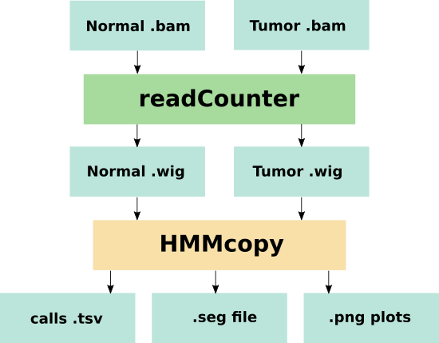

# hmmcopy

This Seqware workflow is a wrapper for HMMcopy which is a CNV analysis tool capable of making calls using paired Normal/Tumor data. The tool detects copy-number changes and allelic imbalances (including LOH) using deep-sequencing data.Corrects GC and mappability biases for readcounts (i.e. coverage) in non-overlapping windows of fixed length for single whole genome samples, yielding a rough estimate of copy number for furthur analysis. Designed for rapid correction of high coverage whole genome tumour and normal samples.



## Overview

## Dependencies

* [hmmcopy-utils 0.1.1](https://bioconductor.org/packages/HMMcopy/)
* [hmmcopy 1.28.1](https://bioconductor.org/packages/HMMcopy/)
* [rstats 4.0](http://cran.utstat.utoronto.ca/src/base/R-3/R-4.0.tar.gz)


## Usage

### Cromwell
```
java -jar cromwell.jar run hmmcopy.wdl --inputs inputs.json
```

### Inputs

#### Required workflow parameters:
Parameter|Value|Description
---|---|---
`inputTumor`|File|input .bam file for tumor sample
`inputNormal`|File|input .bam file for normal sample
`reference`|String|reference assembly id


#### Optional workflow parameters:
Parameter|Value|Default|Description
---|---|---|---
`outputFileNamePrefix`|String|""|Output file(s) prefix


#### Optional task parameters:
Parameter|Value|Default|Description
---|---|---|---
`normalConvert.modules`|String|"hmmcopy-utils/0.1.1"|required modules, basicall hmmcopy utils
`normalConvert.readCounter`|String|"$HMMCOPY_UTILS_ROOT/bin/readCounter"|Path to readCounter utility
`normalConvert.chromosomes`|String?|None|comma-separated list of chromosomes to use, default is ALL
`normalConvert.window`|Int?|None|Resolution of a bin, in bases, default is 1000
`normalConvert.jobMemory`|Int|8|memory for this job, in Gb
`normalConvert.timeout`|Int|20|Timeout in hours, needed to override imposed limits
`tumorConvert.modules`|String|"hmmcopy-utils/0.1.1"|required modules, basicall hmmcopy utils
`tumorConvert.readCounter`|String|"$HMMCOPY_UTILS_ROOT/bin/readCounter"|Path to readCounter utility
`tumorConvert.chromosomes`|String?|None|comma-separated list of chromosomes to use, default is ALL
`tumorConvert.window`|Int?|None|Resolution of a bin, in bases, default is 1000
`tumorConvert.jobMemory`|Int|8|memory for this job, in Gb
`tumorConvert.timeout`|Int|20|Timeout in hours, needed to override imposed limits
`runHMMcopy.rScript`|String|"$RSTATS_ROOT/bin/Rscript"|Path to Rscript
`runHMMcopy.hmmcopyScript`|String|"$HMMCOPY_SCRIPTS_ROOT/run_HMMcopy.r"|Path to .R script that runs HMMcopy pipeline
`runHMMcopy.jobMemory`|Int|8|memory in GB for this job
`runHMMcopy.timeout`|Int|20|Timeout in hours, needed to override imposed limits


### Outputs

Output | Type | Description
---|---|---
`resultiSegFile`|File|.seg file produced with HMMcopy
`resultTsvFile`|File|.tsv file with all calls produced by HMMcopy
`cgBiasImage`|File|Plot showing the results of CG bias test
`segImage`|File|Plot shows the segmentation data


## Commands
 This section lists command(s) run by hmmcopy workflow
 
 * Running hmmcopy
 
 HMMcopy workflow uses R package hmmcopy utilizing custom R scripts.
 
 Pre-processing:
 
 ```
   READ_COUNTER -b INPUT_FILE
   READ_COUNTER -w WINDOW (Optional) -c CHROMOSOMES (Optional) INPUT_FILE > INPUT_FILE_BASENAME_reads.wig
 
 ```
 Running the analysis:
 
 ```
   Rscript HMMCOPY_SCRIPT NORMAL_WIG TUMOR_WIG CG_FILE MAP_FILE OUTPUT_PREFIX
   zip -q OUTPUT_PREFIX_images.zip *.png
 
 ```
 ## Support

For support, please file an issue on the [Github project](https://github.com/oicr-gsi) or send an email to gsi@oicr.on.ca .

_Generated with generate-markdown-readme (https://github.com/oicr-gsi/gsi-wdl-tools/)_
